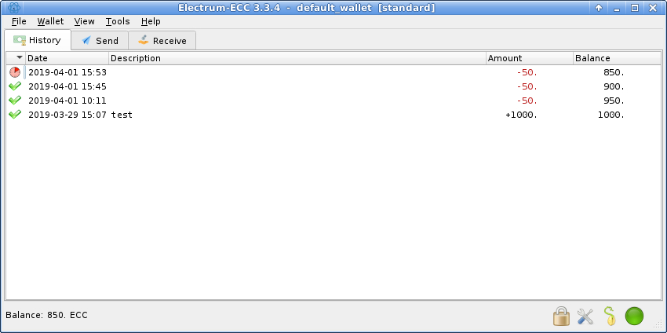

**Electrum-ECC**

It’s so simple. Just start Electrum-ECC, create your wallet, then send
and receive ECC immediately.

Electrum-ECC gives users a simple desktop wallet app (Windows, MacOs,
Linux) that does not need a local copy of the blockchain. Rather than
the lengthy blockchain synchronisation process required to sync a full
node, the Electrum-ECC client securely connects to an Electrum server
for all its blockchain business whilst all crypto keys are held securely
on the user’s device.

The Electrum-ECC wallet is created from a key phrase consisting of 12
random words. This means that if the user’s device is stolen or
experiences unrecoverable data loss, the exact same wallet can be
re-created on another device simply by entering the 12 word key phrase.
And for the ultimate in cold storage security, you can securely delete
your Electrum-ECC installation with your wallet key phrase stored in a
safe place for later re-creation.

However, because the Electrum-ECC client app is not a full node, it is
unable to stake and supports only payment transactions. If you wish to
support ECC’s network security by staking or access future network
services, you need to run a full node. You can run both, but bear mind
that even with both installed on the same device, the full node and
Electrum-ECC wallets remain entirely separate.

Electrum-ECC has been adapted from recent versions of the ElectrumX
server and Electrum client apps for Bitcoin. It is tried and tested
software with a very large community of users. Rather than fork the
ElectrumX server, the changes necessary to support ECC were contributed
back into the ElectrumX project, which already has support for a number
of other coins. You can see those changes to add ECC support here:

<https://github.com/kyuupichan/electrumx/pull/769>

The client app we decided to use (there are several) was not set up for
multi-coin support, so it was necessary to fork that into the ECC
project:

<https://github.com/project-ecc/electrum-ecc>

To get early access to Electrum-ECC:

<https://github.com/project-ecc/electrum-ecc/releases>
